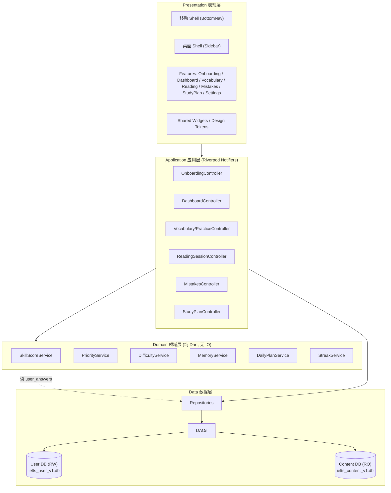
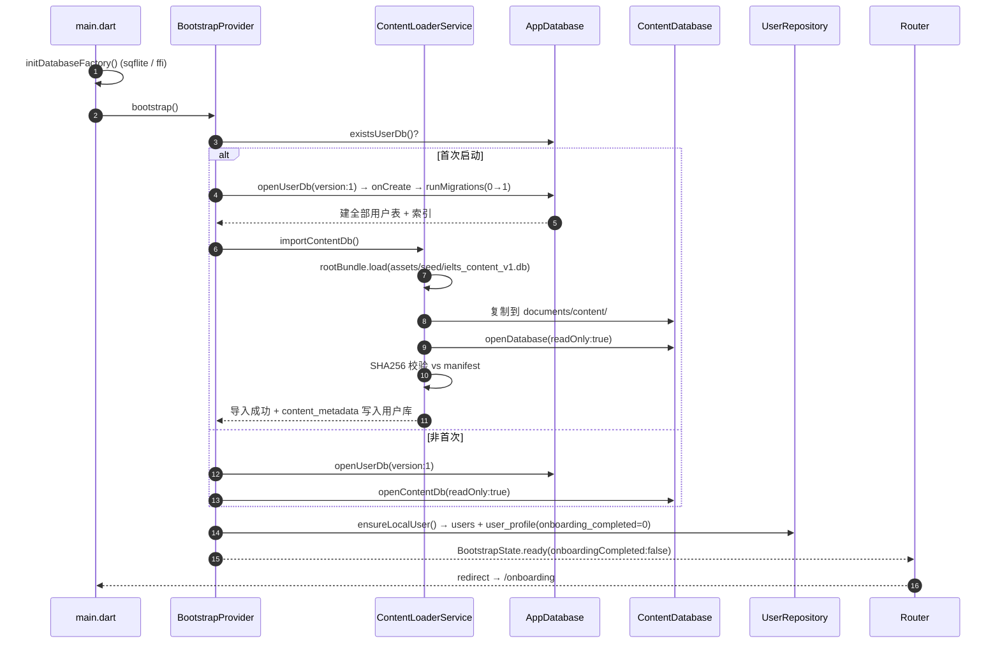
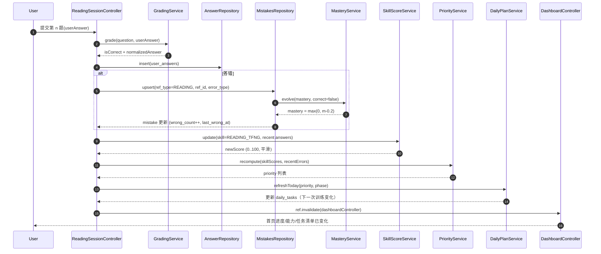
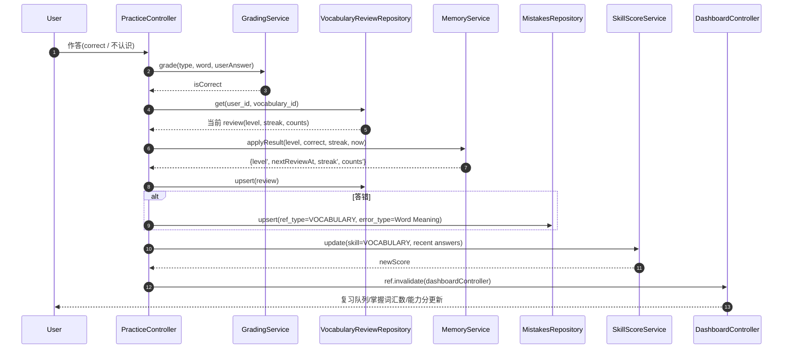

# IELTS Free —— V0.1 系统架构设计 + 任务分解（ARCHITECTURE）

> 文档版本：v0.1（对应 PRD-v0.1 / BRIEF）
> 作者：架构师 高见远
> 事实来源：`docs/BRIEF.md`（唯一事实来源）、`docs/PRD-v0.1.md`
> 范围：仅覆盖 V0.1 MVP（Dashboard / Vocabulary / Reading / Mistakes / Adaptive Engine / Daily Plan + Onboarding + 本地库 + 种子内容）。听力/写作/口语/统计/成就/收藏/笔记页面**不做实现**（仅占位）。
> 本文档**只做设计与任务分解**，不含实现代码；伪代码、DDL、JSON 样例除外。

---

## 1. 实现方案总览

### 1.1 分层架构

| 层 | 目录 | 职责（一句话） | 允许依赖 |
| --- | --- | --- | --- |
| **Presentation（表现层）** | `lib/features/*/presentation`、`lib/shared/widgets` | 渲染 UI、收集用户输入、监听 Provider 状态，**不含业务规则** | domain/application、shared |
| **Application（应用层）** | `lib/features/*/application`、`lib/core/providers` | 编排用例：调用领域服务 + 仓储，管理页面级状态（Riverpod Notifier） | domain、data |
| **Domain（领域层）** | `lib/core/services`、`lib/core/models` | 纯 Dart 业务规则：评分 / 优先级 / 难度 / 记忆 / 每日计划 / streak，**无 IO、无 Flutter 依赖、可单测** | 仅 models + utils |
| **Data（数据层）** | `lib/core/database`、`lib/core/storage` | SQLite 连接、DAO、Repository 实现、Migration、内容库导入 | models、errors、utils |

**依赖方向单向向下**：presentation → application → domain/data → models。领域层不反向依赖任何上层，保证算法 100% 可单测（FR-060/062/063、BRIEF 七十六）。

### 1.2 整体架构图



### 1.3 离线优先的落地方式

- **核心路径零网络调用**：全部数据来自两个本地 SQLite 文件 + asset；`pubspec.yaml` 不引入任何运行期联网包（见 §8）。
- **字体**：使用系统字体族（`Roboto`/平台默认），**禁止 `google_fonts`**（运行期取字体）。若需打包字体，走 `assets/fonts` 本地声明。
- **Android 权限**：`src/main/AndroidManifest.xml` **不声明 `INTERNET`**；`src/debug` 与 `src/profile` 声明（Flutter 热重载/observatory 需要）。详见 §2.5。
- **预置内容库**：`assets/seed/ielts_content_v1.db` 随包分发，首次启动复制到可写目录后**以只读方式打开**（§4.1）。

---

## 2. 关键技术决策

### 2.1 【最终结论】数据库路线：选择 **路线 B —— sqflite + sqflite_common_ffi（手写 SQL + DAO，零代码生成）**

| 维度 | 路线 A：Drift + build_runner | 路线 B：sqflite + ffi（**采用**） |
| --- | --- | --- |
| 交付即可构建 | ❌ 缺 `.g.dart`，clone 后必须先 codegen | ✅ clone → `flutter pub get` → `flutter run` |
| 本机构建机（无工具链）可否验证 | ❌ 无法跑 build_runner，工程师交付物**不可本地验证** | ✅ 源码可逐行审查，`flutter analyze` 直接可跑 |
| CI 复杂度 | 需在 `test` 前插入 codegen step，CI 失败面更大 | ✅ CI 无额外步骤 |
| 源码可审计性 | 生成文件巨大不可读 | ✅ 全手写，符合「开源可审计」（BRIEF 三-6） |
| Migration | Drift 自动迁移（FR-083 友好） | 手写 `onUpgrade` + `PRAGMA user_version`（等价能力） |
| 平台覆盖 | 好 | Android=`sqflite`；Windows/Linux/macOS=`sqflite_common_ffi`；均为一等公民 |
| 与 BRIEF 一致性 | ✅ 符合第七条 Drift 推荐 | ⚠️ 偏离推荐，需论证（见下） |

**选择理由（按权重排序）**

1. **交付物必须可被用户与 CI 直接构建**是本次环境约束下的最高优先级（BRIEF 二：构建机无 Flutter/Android SDK/VS 工具链）。路线 A 会交付一个「缺生成文件、无法编译」的仓库，且工程师本机也无法跑 build_runner 去补生成——**交付物不可验证**，风险不可接受。
2. 路线 B **零额外步骤**：用户 clone → `flutter pub get` → `flutter run`；CI 直接 `flutter analyze` + `flutter test`。
3. 路线 B 完全满足三条硬约束：离线（无联网包）、内容库只读 + 用户库读写分离（`readOnly: true` 打开内容库）、Migration 不丢数据（`onUpgrade` 只做 `ALTER TABLE`/`CREATE TABLE`，绝不 `DROP`）。
4. **偏离 BRIEF 第七条的风险被 Repository 模式隔离**：数据层以抽象 `Repository` 接口暴露，领域层只依赖接口。若 V0.2 需要 Drift 的更强类型安全，可在不动领域层/UI 层的前提下替换实现（详见 §9.4）。

**路线 B 的 Migration 等价机制（替代 Drift 的自动迁移）**

```dart
// core/database/app_database.dart —— 伪代码，仅示意
const kUserDbVersion = 1;

Future<Database> openUserDb() async {
  return openDatabase(
    userDbPath,
    version: kUserDbVersion,
    onConfigure: (db) async => db.execute('PRAGMA foreign_keys = ON'),
    onCreate: (db, v) async => runMigrations(db, from: 0, to: v),
    onUpgrade: (db, from, to) async => runMigrations(db, from: from, to: to),
    onDowngrade: onDatabaseDowngradeDelete, // 仅开发期；生产走备份保护
  );
}

// migrations.dart —— 版本化、幂等、只增不减
final Map<int, List<String>> _steps = {
  1: [ /* v0→v1: CREATE TABLE ... 全部初始表 */ ],
  2: [ 'ALTER TABLE user_profile ADD COLUMN font_scale REAL NOT NULL DEFAULT 1.0',
       'CREATE INDEX IF NOT EXISTS idx_x ON ...' ], // 未来示例：不 DROP、不丢数据
};

Future<void> runMigrations(Database db, {required int from, required int to}) async {
  for (var v = from + 1; v <= to; v++) {
    for (final sql in _steps[v] ?? const []) {
      await db.execute(sql);
    }
  }
}
```

- `PRAGMA user_version` 由 sqflite 的 `version` 参数自动维护，等价于 Drift 的 schema version。
- **迁移前置保护**：升级前 `VACUUM INTO` 一份备份到 `backups/`，失败可回滚（FR-083 / NFR-30）。
- **CI 与 README 无需 codegen 命令**（这是选 B 的直接收益）。

### 2.2 状态管理（Riverpod 组织方式）

使用 `flutter_riverpod`（**不使用 `riverpod_generator`，避免 codegen**）。分层约定：

| Provider 类型 | 用途 | 示例 |
| --- | --- | --- |
| `Provider` | 无状态依赖注入（DB / DAO / Repository / Service / Clock） | `userDatabaseProvider`、`skillScoreServiceProvider` |
| `FutureProvider` / `StreamProvider` | 只读异步数据（列表、详情） | `vocabularyListProvider`、`mistakeListProvider` |
| `AsyncNotifierProvider` | 有状态、需异步初始化与写操作的控制器 | `DashboardController`、`ReadingSessionController` |
| `NotifierProvider` | 纯同步状态（Onboarding 步骤、筛选条件） | `OnboardingController`、`MistakeFilterController` |

- 命名规范：`xxxProvider`（小写驼峰）；Controller 类名 `XxxController`；文件 `xxx_controller.dart`。
- **写操作后失效下游**：控制器完成写库后 `ref.invalidate(dashboardControllerProvider)` 触发 Dashboard 重算（闭环 FR-064）。
- `ProviderScope` 在 `main.dart` 注入 `overrides`，测试时用内存 DB 覆盖（§9）。

### 2.3 路由（go_router）

**两套 ShellRoute**：根路由用 `LayoutBuilder`/`MediaQuery` 判定宽度（`< 900` → 移动 Shell；`>= 900` → 桌面 Shell），两套 Shell 共享同一批子路由定义。

```dart
// app/router.dart —— 路由表（伪代码）
final router = GoRouter(
  initialLocation: '/bootstrap',
  redirect: bootstrapRedirect,          // 未完成 Onboarding → /onboarding
  routes: [
    GoRoute(path: '/bootstrap', builder: BootstrapPage.new),
    GoRoute(path: '/onboarding', builder: OnboardingPage.new),

    // 移动端 Shell（BottomNav：首页/学习/练习/错题/我的）
    ShellRoute(builder: MobileShell.new, routes: [
      GoRoute(path: '/home',  builder: DashboardPage.new),
      GoRoute(path: '/learn', builder: LearnHubPage.new),
      GoRoute(path: '/practice', builder: PracticeHubPage.new),
      GoRoute(path: '/mistakes', builder: MistakesPage.new,
        routes: [GoRoute(path: ':id', builder: MistakeDetailPage.new)]),
      GoRoute(path: '/me', builder: MePage.new),
    ]),

    // 桌面端 Shell（Sidebar）
    ShellRoute(builder: DesktopShell.new, routes: [
      GoRoute(path: '/dashboard', builder: DashboardPage.new),
      GoRoute(path: '/vocabulary', builder: VocabularyListPage.new,
        routes: [GoRoute(path: ':id', builder: VocabularyDetailPage.new)]),
      GoRoute(path: '/reading', builder: ReadingListPage.new,
        routes: [GoRoute(path: ':id', builder: ReadingSessionPage.new)]),
      GoRoute(path: '/study-plan', builder: StudyPlanPage.new),
      GoRoute(path: '/settings', builder: SettingsPage.new,
        routes: [GoRoute(path: 'about', builder: AboutPage.new)]),
      // V0.2 占位（置灰 + "V0.2" 标注，PRD Q-7）
      GoRoute(path: '/listening', builder: ListeningPlaceholderPage.new),
      GoRoute(path: '/writing',   builder: WritingPlaceholderPage.new),
      GoRoute(path: '/speaking',  builder: SpeakingPlaceholderPage.new),
      GoRoute(path: '/statistics',builder: StatisticsPlaceholderPage.new),
    ]),

    // 全屏（无 Shell）：做题页
    GoRoute(path: '/practice/vocabulary', builder: VocabularyPracticePage.new),
  ],
);
```

- 词汇练习与阅读做题页在**桌面端**为右栏、**移动端**为全屏推入；实现上统一为独立全屏路由 + 内部响应式布局（`ReadingSplitLayout`）。

### 2.4 主题（Design Tokens → `theme.dart`）

采用 PRD **Q-3 默认色值**，收敛为 `AppColors` 常量 + `ThemeData`（light/dark 共用一套 token，PRD Q-6 做深色模式）。

| Token | Light | Dark（派生） | 用途 |
| --- | --- | --- | --- |
| Primary | `#1E3A5F` | `#8FB4E0` | 品牌深蓝、AppBar、主按钮 |
| Secondary | `#2F6FED` | `#7EA6FF` | 交互强调、选中态 |
| Background | `#FFFFFF` | `#121417` | 页面底 |
| Surface | `#F5F7FA` | `#1E2126` | 卡片分区 |
| Success | `#2E7D32` | `#66BB6A` | 正确 / 掌握 |
| Warning | `#ED6C02` | `#FFB74D` | 提示 / 即将到期 |
| Error | `#D32F2F` | `#EF5350` | 错误 / 不认识 |
| Text | `#1A1C1E` | `#E6E8EB` | 主文字 |
| Muted | `#5F6368` | `#9AA0A6` | 次要文字 |

- **间距/圆角/字号 token**：`AppSpacing`（4/8/12/16/24/32）、`AppRadius`（8/12/16）、`AppTextStyles`（body 15~16，标题分级，支持 Font Size 缩放因子）。
- **禁止页面写死颜色**（FR-002）：一律 `Theme.of(context).colorScheme.*` 或 `AppColors.*`。禁止过度渐变/发光/复杂动画（BRIEF 八十）。

### 2.5 Android 网络权限分离（离线硬约束）

| 文件 | `INTERNET` 权限 | 说明 |
| --- | --- | --- |
| `android/app/src/main/AndroidManifest.xml` | **不声明** | Release 产物无网络权限 |
| `android/app/src/debug/AndroidManifest.xml` | 声明 | 热重载 / VM Service 需要 |
| `android/app/src/profile/AndroidManifest.xml` | 声明 | profile 构建需要 |

- Flutter 官方模板默认即把 `INTERNET` 放在 debug/profile，工程师只需**确认 main 中不存在**，并在 `README` 的「离线验证」章节写明用 `aapt dump permissions` 校验 Release APK 无 `INTERNET`。

---

## 3. 完整文件列表（V0.1 施工图）

> 约定：`[G]` = 平台脚手架（由 `flutter create` 生成，原样保留，仅按 §2.5 调整 manifest）；其余为需手写文件。
> V0.1 **不创建** listening/writing/speaking/statistics/achievements 的功能实现，仅创建占位页。

### 3.1 根目录与工程配置

| 相对路径 | 职责 |
| --- | --- |
| `pubspec.yaml` | 依赖、asset、字体声明、SDK 约束 |
| `analysis_options.yaml` | 启用 `flutter_lints`，禁 `print`，开 strict 模式 |
| `.gitignore` | 排除 build/、.dart_tool/、`*.iml`（路线 B **无需**忽略 `*.g.dart`） |
| `.metadata` `[G]` | Flutter 工程元数据 |
| `README.md` | 产品介绍 + 离线/免费/开源徽章 + 安装 + 架构 + 离线验证步骤（BRIEF 五十八/一百零七） |
| `LICENSE` | 代码 License（MIT 优先，BRIEF 一百零六） |
| `LICENSE-CONTENT` | 教育内容独立 License 声明（BRIEF 一百零六） |
| `CONTRIBUTING.md` | 贡献流程；内容贡献须审核（BRIEF 一百零五） |
| `CODE_OF_CONDUCT.md` | 行为准则（BRIEF 五十七） |
| `SECURITY.md` | 安全与隐私声明（BRIEF 五十七） |
| `CHANGELOG.md` | 版本变更（BRIEF 五十七） |
| `.github/workflows/tests.yml` | push/PR 触发 `flutter analyze` + `flutter test` |
| `.github/workflows/android.yml` | 构建 Android（骨架，可先占位） |
| `.github/workflows/windows.yml` | 构建 Windows（骨架，可先占位） |
| `.github/workflows/release.yml` | tag `v*` → 测试 → build → checksum → Release（BRIEF 一百零三） |
| `.github/ISSUE_TEMPLATE/bug_report.md` | Bug 模板 |
| `.github/ISSUE_TEMPLATE/feature_request.md` | 需求模板 |
| `.github/ISSUE_TEMPLATE/content_error.md` | 内容纠错模板 |
| `.github/ISSUE_TEMPLATE/question.md` | 提问模板 |

### 3.2 平台脚手架

| 相对路径 | 职责 |
| --- | --- |
| `android/app/src/main/AndroidManifest.xml` `[G]` | **无 INTERNET**（§2.5） |
| `android/app/src/debug/AndroidManifest.xml` `[G]` | 声明 INTERNET（debug） |
| `android/app/src/profile/AndroidManifest.xml` `[G]` | 声明 INTERNET（profile） |
| `android/app/build.gradle` `[G]` | applicationId / minSdk / signing |
| `android/build.gradle` `android/settings.gradle` `android/gradle.properties` `[G]` | Android 构建配置 |
| `windows/**` `[G]` | Windows Runner（CMake + runner），原样保留 |
| `ios/ macos/ linux/**` `[G]` | V0.1 不构建，保留脚手架以便 V2 |

### 3.3 `lib/` 应用与核心

| 相对路径 | 职责 |
| --- | --- |
| `lib/main.dart` | 入口：`WidgetsFlutterBinding`、DB factory 初始化、`ProviderScope`、`IeltsFreeApp` |
| `lib/app/app.dart` | 根 `MaterialApp.router`，绑定 router + theme + locale |
| `lib/app/router.dart` | go_router 路由表 + 两套 ShellRoute + redirect（§2.3） |
| `lib/app/theme.dart` | Design Tokens（AppColors/AppSpacing/AppRadius/AppTextStyles）+ light/dark ThemeData |
| `lib/app/constants.dart` | 常量：DB 文件名、版本、默认用户、asset 路径、分页大小 |
| `lib/app/strings.dart` | V0.1 UI 文案常量（中文；不用 gen-l10n 以免 codegen） |

**core/database**

| 相对路径 | 职责 |
| --- | --- |
| `lib/core/database/database_factory.dart` | 平台选择：Android→`sqflite`；桌面→`sqflite_common_ffi`（`databaseFactoryFfi`） |
| `lib/core/database/app_database.dart` | 用户库打开/关闭、version、onCreate/onUpgrade、外键开关 |
| `lib/core/database/content_database.dart` | 内容库：asset→可写目录复制、`readOnly:true` 打开、checksum 校验 |
| `lib/core/database/migrations.dart` | 版本化迁移脚本表 + `runMigrations`（§2.1） |
| `lib/core/database/schema_user.dart` | 用户库 DDL 常量（CREATE TABLE/INDEX，全部表） |
| `lib/core/database/schema_content.dart` | 内容库 DDL 常量（只读库结构，与 `content_pipeline/schema.sql` 对齐） |

**core/models**（每文件一个模型 + `fromMap`/`toMap`）

| 相对路径 | 职责 |
| --- | --- |
| `lib/core/models/enums.dart` | `SkillType`/`ReadingSubSkill`/`QuestionType`/`ErrorType`/`MemoryLevel`/`PlanPhase`/`TaskType`/`RefType` |
| `lib/core/models/vocabulary.dart` | 内容库词汇模型 |
| `lib/core/models/vocabulary_topic.dart` | 词汇-主题多对多 |
| `lib/core/models/reading_passage.dart` | 阅读文章 |
| `lib/core/models/reading_question.dart` | 阅读题目 + 解析字段 |
| `lib/core/models/reading_option.dart` | 选择题选项 |
| `lib/core/models/user.dart` | 用户 |
| `lib/core/models/user_profile.dart` | 档案（身份 + onboarding 状态 + 弱项） |
| `lib/core/models/study_goal.dart` | 目标分数/考试日期/每日时长/计划周期 |
| `lib/core/models/study_plan.dart` | 计划条目 |
| `lib/core/models/daily_task.dart` | 每日任务 |
| `lib/core/models/vocabulary_review.dart` | 词汇记忆状态 |
| `lib/core/models/skill_score.dart` | 五维 + 阅读子维度分数 |
| `lib/core/models/user_answer.dart` | 作答记录 |
| `lib/core/models/mistake.dart` | 错题 |
| `lib/core/models/learning_session.dart` | 学习会话（含 checkpoint） |
| `lib/core/models/learning_statistics.dart` | 统计/streak |
| `lib/core/models/favorite.dart` | 收藏（V0.1 表存在，UI 不做） |
| `lib/core/models/note.dart` | 笔记（V0.1 表存在，UI 不做） |
| `lib/core/models/app_setting.dart` | 键值设置 |
| `lib/core/models/content_metadata.dart` | 已导入内容包元数据 |

**core/storage**（Repository 接口 + 实现；DAO 封装 SQL）

| 相对路径 | 职责 |
| --- | --- |
| `lib/core/storage/dao/base_dao.dart` | DAO 基类：持有 `Database`、事务辅助 |
| `lib/core/storage/dao/vocabulary_dao.dart` | 词汇查询（内容库，只读）：分页、按难度/主题、取词 |
| `lib/core/storage/dao/reading_dao.dart` | 阅读查询（内容库）：文章列表/详情、题目/选项 |
| `lib/core/storage/dao/user_dao.dart` | users/user_profile/study_goal CRUD |
| `lib/core/storage/dao/vocabulary_review_dao.dart` | 记忆状态 upsert、到期复习队列查询 |
| `lib/core/storage/dao/answer_dao.dart` | user_answers 写入、按窗口查询 |
| `lib/core/storage/dao/mistake_dao.dart` | 错题 upsert/累加、列表分页、mastery 更新 |
| `lib/core/storage/dao/skill_score_dao.dart` | skill_scores upsert/读取 |
| `lib/core/storage/dao/daily_task_dao.dart` | 每日任务增删改查、完成状态 |
| `lib/core/storage/dao/statistics_dao.dart` | learning_statistics / learning_sessions |
| `lib/core/storage/dao/settings_dao.dart` | app_settings 键值 |
| `lib/core/storage/repository.dart` | 各仓储抽象接口（领域层唯一依赖） |
| `lib/core/storage/vocabulary_repository.dart` | 词汇仓储实现 |
| `lib/core/storage/reading_repository.dart` | 阅读仓储实现 |
| `lib/core/storage/mistakes_repository.dart` | 错题仓储实现 |
| `lib/core/storage/user_repository.dart` | 用户/目标/档案仓储实现 |
| `lib/core/storage/study_plan_repository.dart` | 计划/每日任务仓储实现 |
| `lib/core/storage/statistics_repository.dart` | 统计/会话仓储实现 |
| `lib/core/storage/settings_repository.dart` | 设置仓储实现 |

**core/services**（领域层，纯 Dart）

| 相对路径 | 职责 |
| --- | --- |
| `lib/core/services/adaptive/skill_score_service.dart` | 能力评分（§5.2） |
| `lib/core/services/adaptive/priority_service.dart` | 训练优先级（§5.3） |
| `lib/core/services/adaptive/difficulty_service.dart` | 难度自适应三规则（§5.4） |
| `lib/core/services/adaptive/memory_service.dart` | 词汇记忆等级 + 复习间隔（§5.1） |
| `lib/core/services/adaptive/daily_plan_service.dart` | 每日任务分配（§5.5） |
| `lib/core/services/adaptive/phase_service.dart` | 倒计时三阶段（§5.6） |
| `lib/core/services/adaptive/mastery_service.dart` | 错题 mastery 演进（§5.7） |
| `lib/core/services/adaptive/streak_service.dart` | 连续学习天数（§5.8） |
| `lib/core/services/content/content_loader_service.dart` | 首次启动：建库→导入内容库→建索引→建档案（FR-084） |
| `lib/core/services/content/seed_service.dart` | 开发/测试用种子注入（可选） |
| `lib/core/services/grading_service.dart` | 判分（词汇 7 类 + 阅读 3 类归一化比对） |
| `lib/core/services/backup_service.dart` | Export `IELTS-Free-Backup.json`（FR-082） |
| `lib/core/services/clock_service.dart` | 可注入时钟（测试用固定时间） |

**core/utils / errors / providers**

| 相对路径 | 职责 |
| --- | --- |
| `lib/core/utils/result.dart` | `Result<T>`（`Ok`/`Err`）类型（§9.2） |
| `lib/core/utils/date_utils.dart` | UTC 存取 / 本地展示、日期差、日界处理（§9.6） |
| `lib/core/utils/logger.dart` | 轻量本地日志（无上报） |
| `lib/core/utils/id_generator.dart` | UUID / 时间戳 ID |
| `lib/core/utils/text_utils.dart` | 答案归一化（大小写/空格/标点）、相似度 |
| `lib/core/errors/app_exception.dart` | 领域异常 |
| `lib/core/errors/failure.dart` | 用户可见失败信息 |
| `lib/core/errors/error_handler.dart` | 统一错误映射 + 日志 |
| `lib/core/providers/database_providers.dart` | DB / DAO Provider |
| `lib/core/providers/repository_providers.dart` | Repository Provider |
| `lib/core/providers/service_providers.dart` | Service / Clock Provider |
| `lib/core/providers/bootstrap_provider.dart` | 启动状态（AsyncNotifier：初始化进度） |

### 3.4 `lib/features/`（表现层 + 应用层）

| 相对路径 | 职责 |
| --- | --- |
| `lib/features/onboarding/presentation/onboarding_page.dart` | 5 步引导容器（进度 + 前进后退） |
| `lib/features/onboarding/presentation/widgets/step_target_band.dart` | 步骤1 目标分数 |
| `lib/features/onboarding/presentation/widgets/step_exam_date.dart` | 步骤2 考试时间 |
| `lib/features/onboarding/presentation/widgets/step_daily_minutes.dart` | 步骤3 每日时长 |
| `lib/features/onboarding/presentation/widgets/step_weakest_skill.dart` | 步骤4 最弱项 |
| `lib/features/onboarding/presentation/widgets/step_initial_test.dart` | 步骤5 初始测试（15 题） |
| `lib/features/onboarding/presentation/widgets/onboarding_progress.dart` | 顶部步骤指示器 |
| `lib/features/onboarding/application/onboarding_controller.dart` | 采集 → 写 profile/goal/skill_scores → 完成 |
| `lib/features/dashboard/presentation/dashboard_page.dart` | 首页（BRIEF 五） |
| `lib/features/dashboard/presentation/widgets/target_countdown_card.dart` | 目标分数 + 倒计时 |
| `lib/features/dashboard/presentation/widgets/daily_progress_card.dart` | 今日进度条 |
| `lib/features/dashboard/presentation/widgets/daily_task_list.dart` | 今日任务清单（可点） |
| `lib/features/dashboard/presentation/widgets/skill_scores_card.dart` | 五维能力 |
| `lib/features/dashboard/presentation/widgets/streak_card.dart` | 连续天数 + 今日时长 |
| `lib/features/dashboard/application/dashboard_controller.dart` | 聚合首页数据（AsyncNotifier） |
| `lib/features/learn/presentation/learn_hub_page.dart` | 移动「学习」Tab 枢纽 |
| `lib/features/practice/presentation/practice_hub_page.dart` | 移动「练习」Tab 枢纽 |
| `lib/features/vocabulary/presentation/vocabulary_list_page.dart` | 词汇列表（分页/筛选） |
| `lib/features/vocabulary/presentation/vocabulary_detail_page.dart` | 词汇详情（BRIEF 十四） |
| `lib/features/vocabulary/presentation/vocabulary_practice_page.dart` | 7 类练习 |
| `lib/features/vocabulary/presentation/widgets/vocabulary_card.dart` | 词汇卡片 |
| `lib/features/vocabulary/presentation/widgets/vocabulary_action_bar.dart` | 发音/收藏/掌握/不认识 |
| `lib/features/vocabulary/presentation/widgets/practice_question_widgets.dart` | 7 种作答控件 |
| `lib/features/vocabulary/application/vocabulary_controller.dart` | 列表/详情状态 |
| `lib/features/vocabulary/application/practice_controller.dart` | 练习会话 + 记忆更新 |
| `lib/features/reading/presentation/reading_list_page.dart` | 阅读列表 |
| `lib/features/reading/presentation/reading_session_page.dart` | 做题页（响应式） |
| `lib/features/reading/presentation/widgets/reading_split_layout.dart` | 桌面 55/45、移动上下堆叠 |
| `lib/features/reading/presentation/widgets/passage_view.dart` | 文章渲染 |
| `lib/features/reading/presentation/widgets/question_view.dart` | 题目渲染（多题型） |
| `lib/features/reading/presentation/widgets/explanation_view.dart` | 解析（evidence/keywords/explanation） |
| `lib/features/reading/application/reading_controller.dart` | 列表状态 |
| `lib/features/reading/application/reading_session_controller.dart` | 作答/计时/提交/判分/错题/能力更新 |
| `lib/features/mistakes/presentation/mistakes_page.dart` | 错题列表 + 筛选 |
| `lib/features/mistakes/presentation/mistake_detail_page.dart` | 错题详情 + 重做 |
| `lib/features/mistakes/presentation/widgets/mistake_tile.dart` | 错题项 |
| `lib/features/mistakes/presentation/widgets/error_type_filter.dart` | 类型/科目筛选 |
| `lib/features/mistakes/application/mistakes_controller.dart` | 错题状态 + 重做 |
| `lib/features/study_plan/presentation/study_plan_page.dart` | 学习计划页 |
| `lib/features/study_plan/presentation/widgets/plan_selector.dart` | 7/30/60/90/Custom |
| `lib/features/study_plan/presentation/widgets/weekly_schedule.dart` | 本周安排 |
| `lib/features/study_plan/application/study_plan_controller.dart` | 计划状态 |
| `lib/features/settings/presentation/settings_page.dart` | 设置（V0.1 最小：目标/时长/深色/字体/导出/删除/About） |
| `lib/features/settings/presentation/about_page.dart` | 免责声明原文（BRIEF 五十六） |
| `lib/features/settings/application/settings_controller.dart` | 设置读写 |
| `lib/features/me/presentation/me_page.dart` | 移动「我的」Tab |
| `lib/features/listening/presentation/listening_placeholder_page.dart` | V0.2 占位 |
| `lib/features/writing/presentation/writing_placeholder_page.dart` | V0.2 占位 |
| `lib/features/speaking/presentation/speaking_placeholder_page.dart` | V0.2 占位 |
| `lib/features/statistics/presentation/statistics_placeholder_page.dart` | V0.2 占位 |

### 3.5 `lib/shared/`

| 相对路径 | 职责 |
| --- | --- |
| `lib/shared/widgets/navigation/mobile_shell.dart` | BottomNav（首页/学习/练习/错题/我的） |
| `lib/shared/widgets/navigation/desktop_shell.dart` | Sidebar（含 V0.2 置灰项） |
| `lib/shared/widgets/navigation/nav_destinations.dart` | 两套导航项定义（共享） |
| `lib/shared/widgets/app_scaffold.dart` | 统一 Scaffold + 响应式容器 |
| `lib/shared/widgets/section_card.dart` | 分区卡片（Surface token） |
| `lib/shared/widgets/linear_progress_bar.dart` | 进度条 |
| `lib/shared/widgets/skill_bar.dart` | 五维能力条 |
| `lib/shared/widgets/empty_state.dart` | 空态 |
| `lib/shared/widgets/error_view.dart` | 错误态 |
| `lib/shared/widgets/loading_indicator.dart` | 加载态 |
| `lib/shared/widgets/primary_button.dart` | 主按钮 |
| `lib/shared/widgets/placeholder_page.dart` | V0.2 通用占位 |
| `lib/shared/extensions/context_extensions.dart` | 主题/尺寸便捷访问 |
| `lib/shared/extensions/datetime_extensions.dart` | 日期格式化 |
| `lib/shared/extensions/string_extensions.dart` | 文本处理 |

### 3.6 `assets/` 与 `content_pipeline/`

| 相对路径 | 职责 |
| --- | --- |
| `assets/seed/ielts_content_v1.db` | **预置内容库（只读）**，V0.1 体量小（< 1 MB）随包提交 |
| `assets/seed/manifest.json` | 内容清单（version/counts/checksum） |
| `assets/seed/vocabulary_seed.json` | 词汇源数据（300 词） |
| `assets/seed/reading_seed.json` | 阅读源数据（8 篇/80 题） |
| `assets/images/app_logo.png` | 图标/启动图 |
| `assets/images/empty_state.png` | 空态插图 |
| `assets/icons/.gitkeep` | 预留 |
| `assets/audio/.gitkeep` | 预留（V0.2） |
| `content_pipeline/README.md` | 流水线说明 + 运行方式 |
| `content_pipeline/requirements.txt` | Python 依赖（仅标准库 + 可选 `jsonschema`） |
| `content_pipeline/schema.sql` | 内容库 DDL（与 `schema_content.dart` 对齐） |
| `content_pipeline/validate_content.py` | 校验：格式/重复/答案一致性 → `Valid/Need Review/Duplicate` |
| `content_pipeline/build_content_db.py` | JSON → `ielts_content_v1.db` + `manifest.json`（含 SHA256） |
| `content_pipeline/vocabulary/.gitkeep` | 词汇生成脚本目录（V0.1 最小） |
| `content_pipeline/reading/.gitkeep` | 阅读生成脚本目录（V0.1 最小） |
| `content_pipeline/validators/.gitkeep` | 校验器目录 |
| `content_pipeline/generated/.gitkeep` | 中间产物目录 |

### 3.7 `test/` 与 `integration_test/`

| 相对路径 | 职责 |
| --- | --- |
| `test/helpers/test_database.dart` | 内存 ffi 库 + 建表（隔离测试） |
| `test/helpers/fixtures.dart` | 固定测试数据（词汇/阅读/答案） |
| `test/unit/memory_service_test.dart` | 记忆等级 + 间隔（FR-033/034） |
| `test/unit/skill_score_service_test.dart` | 能力评分（FR-060） |
| `test/unit/priority_service_test.dart` | 优先级（FR-062） |
| `test/unit/difficulty_service_test.dart` | 难度三规则（FR-063） |
| `test/unit/daily_plan_service_test.dart` | 每日任务（FR-070） |
| `test/unit/streak_service_test.dart` | streak 跨天/中断（§5.8） |
| `test/unit/grading_service_test.dart` | 判分归一化 |
| `test/data/migration_test.dart` | v1→v2 不丢数据（FR-083/NFR-30） |
| `test/data/repository_test.dart` | 仓储 CRUD + 分页 |
| `test/data/content_loader_test.dart` | 首次启动导入流程 |
| `test/widget/dashboard_page_test.dart` | 首页渲染 |
| `test/widget/vocabulary_detail_test.dart` | 词汇详情 |
| `test/widget/reading_session_test.dart` | 阅读做题 |
| `integration_test/app_boot_test.dart` | 冷启动 → Onboarding → Dashboard |
| `integration_test/learning_loop_test.dart` | 闭环：答题→错题→能力→任务变化（FR-064） |

---

## 4. 数据模型

### 4.1 内容库（只读）分发与打开

| 步骤 | 做法 |
| --- | --- |
| 打包 | `assets/seed/ielts_content_v1.db` 作为 Flutter asset 随包分发（V0.1 体积小，**随 Git 提交**；大内容包 V0.3 改走 Release Asset） |
| 首次启动 | `rootBundle.load()` 读字节 → 写入 `getApplicationDocumentsDirectory()/content/ielts_content_v1.db` |
| 校验 | 计算 SHA256 与 `manifest.json`/`content_metadata` 比对 |
| 打开 | `openDatabase(path, readOnly: true, singleInstance: true)` —— **任何写操作抛错**（硬约束） |
| 升级 | 内容版本变化时覆盖复制（用户库不受影响，版本解耦 BRIEF 七十四） |

> 说明：SQLite 需要**文件路径**，Android asset 不能直接当文件打开，故必须复制到可写目录；`readOnly:true` 保证只读语义。

### 4.2 内容库表结构（`content DB`，只读）

**vocabulary**

| 字段 | 类型 | 约束 | 说明 |
| --- | --- | --- | --- |
| id | INTEGER | PK AUTOINCREMENT | |
| word | TEXT | NOT NULL, UNIQUE | 单词 |
| phonetic | TEXT | | 音标 |
| part_of_speech | TEXT | | 词性 |
| meaning_cn | TEXT | NOT NULL | 中文释义 |
| meaning_en | TEXT | | 英文释义 |
| difficulty | INTEGER | NOT NULL, CHECK 1..5 | 难度 |
| cefr | TEXT | | A1..C2 |
| ielts_level | TEXT | | 雅思级别标注 |
| synonyms | TEXT | JSON | 同义词数组 |
| antonyms | TEXT | JSON | 反义词数组 |
| collocations | TEXT | JSON | 搭配数组 |
| examples | TEXT | JSON | `[{en,cn}]` |
| writing_usage | TEXT | | Writing 用法 |
| speaking_usage | TEXT | | Speaking 用法 |
| common_mistakes | TEXT | JSON | 常见错误 |
| related_words | TEXT | JSON | 关联词 |
| created_at | TEXT | ISO-8601 | |

索引：`idx_vocab_word(word)`（唯一）、`idx_vocab_difficulty(difficulty)`、`idx_vocab_cefr(cefr)`

**vocabulary_topics**

| 字段 | 类型 | 约束 |
| --- | --- | --- |
| id | INTEGER | PK |
| vocabulary_id | INTEGER | NOT NULL, FK→vocabulary(id) |
| topic | TEXT | NOT NULL |

索引：`idx_vt_vocab(vocabulary_id)`、`idx_vt_topic(topic)`

**reading_passages**

| 字段 | 类型 | 约束 |
| --- | --- | --- |
| id | INTEGER | PK |
| title | TEXT | NOT NULL |
| topic | TEXT | |
| difficulty | INTEGER | CHECK 1..5 |
| band | TEXT | 如 "5.0-6.0" |
| reading_time_sec | INTEGER | |
| passage | TEXT | NOT NULL（正文） |
| skills | TEXT | JSON 数组 |

索引：`idx_rp_difficulty`、`idx_rp_topic`

**reading_questions**

| 字段 | 类型 | 约束 |
| --- | --- | --- |
| id | INTEGER | PK |
| passage_id | INTEGER | NOT NULL, FK→reading_passages(id) |
| order_index | INTEGER | NOT NULL |
| question_type | TEXT | NOT NULL（枚举：TFNG/YNNG/MC/MATCH_HEADINGS/MATCH_INFO/SENTENCE_COMPLETION/SUMMARY_COMPLETION/TABLE_COMPLETION/NOTE_COMPLETION） |
| prompt | TEXT | NOT NULL |
| correct_answer | TEXT | NOT NULL |
| evidence | TEXT | 原文证据 |
| keywords | TEXT | JSON |
| synonyms | TEXT | JSON（同义替换） |
| logic | TEXT | 逻辑说明 |
| explanation | TEXT | 解析 |
| skill | TEXT | 子技能（READING_TFNG/READING_MC/READING_SUMMARY/DETAIL/INFERENCE…） |
| difficulty | INTEGER | CHECK 1..5 |

索引：`idx_rq_passage(passage_id)`、`idx_rq_type(question_type)`

**reading_options**

| 字段 | 类型 | 约束 |
| --- | --- | --- |
| id | INTEGER | PK |
| question_id | INTEGER | NOT NULL, FK→reading_questions(id) |
| order_index | INTEGER | |
| label | TEXT | A/B/C/D |
| content | TEXT | NOT NULL |
| is_correct | INTEGER | 0/1 |

索引：`idx_ro_question(question_id)`

### 4.3 用户库表结构（`user DB`，读写）

**users**

| 字段 | 类型 | 约束 |
| --- | --- | --- |
| id | TEXT | PK（`local_user`） |
| created_at | TEXT | NOT NULL |
| updated_at | TEXT | |

**user_profile**

| 字段 | 类型 | 约束 |
| --- | --- | --- |
| user_id | TEXT | PK, FK→users(id) |
| display_name | TEXT | |
| weakest_skill | TEXT | Onboarding 第4步 |
| onboarding_completed | INTEGER | 0/1 default 0 |
| created_at | TEXT | |
| updated_at | TEXT | |

**study_goal**

| 字段 | 类型 | 约束 |
| --- | --- | --- |
| id | INTEGER | PK |
| user_id | TEXT | NOT NULL, FK→users(id) |
| target_band | REAL | NOT NULL default 7.0 |
| exam_date | TEXT | nullable（ISO date） |
| daily_study_minutes | INTEGER | NOT NULL default 60 |
| plan_type | TEXT | DAY7/DAY30/DAY60/DAY90/CUSTOM |
| plan_start_date | TEXT | |
| plan_end_date | TEXT | |
| is_active | INTEGER | 0/1 |
| created_at / updated_at | TEXT | |

索引：`idx_sg_user(user_id)`、`idx_sg_active(user_id, is_active)`

**study_plan**

| 字段 | 类型 | 约束 |
| --- | --- | --- |
| id | INTEGER | PK |
| user_id | TEXT | FK |
| goal_id | INTEGER | FK→study_goal(id) |
| day_index | INTEGER | |
| plan_date | TEXT | |
| phase | TEXT | FOUNDATION/FOCUS/COMPREHENSIVE |
| summary | TEXT | JSON |
| created_at | TEXT | |

索引：`idx_sp_user_date(user_id, plan_date)`

**daily_tasks**

| 字段 | 类型 | 约束 |
| --- | --- | --- |
| id | INTEGER | PK |
| user_id | TEXT | FK |
| plan_date | TEXT | NOT NULL |
| task_type | TEXT | VOCAB_REVIEW/VOCAB_PRACTICE/READING/MISTAKE_REVIEW |
| skill | TEXT | |
| title | TEXT | |
| target_minutes | INTEGER | |
| item_count | INTEGER | |
| completed_count | INTEGER | default 0 |
| status | TEXT | PENDING/IN_PROGRESS/DONE |
| sort_order | INTEGER | |
| payload | TEXT | JSON（wordIds / passageId 等） |
| created_at / updated_at | TEXT | |

索引：`idx_dt_user_date(user_id, plan_date)`、`idx_dt_status(user_id, status)`

**vocabulary_reviews**

| 字段 | 类型 | 约束 |
| --- | --- | --- |
| id | INTEGER | PK |
| user_id | TEXT | FK |
| vocabulary_id | INTEGER | 引用内容库（**跨库无外键**） |
| memory_level | INTEGER | default 0, CHECK 0..6 |
| correct_count | INTEGER | default 0 |
| wrong_count | INTEGER | default 0 |
| streak | INTEGER | default 0 |
| last_reviewed_at | TEXT | |
| next_review_at | TEXT | |
| is_mastered | INTEGER | 0/1 |
| is_favorite | INTEGER | 0/1 |
| created_at / updated_at | TEXT | |

索引：`idx_vr_user_vocab(user_id, vocabulary_id)`（唯一）、`idx_vr_due(user_id, next_review_at)`

**skill_scores**

| 字段 | 类型 | 约束 |
| --- | --- | --- |
| id | INTEGER | PK |
| user_id | TEXT | FK |
| skill | TEXT | VOCABULARY/READING/LISTENING/WRITING/SPEAKING/READING_TFNG/READING_MC/READING_SUMMARY/DETAIL/INFERENCE |
| score | REAL | default 0 |
| current_difficulty | INTEGER | default 2, CHECK 1..5 |
| sample_count | INTEGER | default 0 |
| last_practiced_at | TEXT | |
| updated_at | TEXT | |

索引：`idx_ss_user_skill(user_id, skill)`（唯一）

**user_answers**

| 字段 | 类型 | 约束 |
| --- | --- | --- |
| id | INTEGER | PK |
| user_id | TEXT | FK |
| ref_type | TEXT | VOCABULARY/READING |
| ref_id | INTEGER | 题目/词 id |
| skill | TEXT | |
| user_answer | TEXT | |
| is_correct | INTEGER | 0/1 |
| difficulty | INTEGER | |
| time_spent_ms | INTEGER | |
| session_id | TEXT | FK→learning_sessions(id) |
| answered_at | TEXT | UTC |

索引：`idx_ua_user_time(user_id, answered_at)`、`idx_ua_skill(user_id, skill)`

**mistakes**

| 字段 | 类型 | 约束 |
| --- | --- | --- |
| id | INTEGER | PK |
| user_id | TEXT | FK |
| ref_type | TEXT | VOCABULARY/READING |
| ref_id | INTEGER | |
| question_type | TEXT | |
| skill | TEXT | |
| user_answer | TEXT | |
| correct_answer | TEXT | |
| error_type | TEXT | 见 Taxonomy |
| difficulty | INTEGER | |
| wrong_count | INTEGER | default 1 |
| last_wrong_at | TEXT | |
| mastery | REAL | default 0.0, 0..1 |
| created_at / updated_at | TEXT | |

索引：`idx_mk_user(user_id)`、`idx_mk_type(user_id, ref_type)`、`idx_mk_error(error_type)`、唯一 `(user_id, ref_type, ref_id)`

**learning_sessions**

| 字段 | 类型 | 约束 |
| --- | --- | --- |
| id | TEXT | PK（UUID） |
| user_id | TEXT | FK |
| session_type | TEXT | VOCABULARY/READING |
| started_at / ended_at | TEXT | |
| duration_sec | INTEGER | |
| items_completed | INTEGER | |
| checkpoint | TEXT | JSON（崩溃恢复） |
| status | TEXT | ACTIVE/COMPLETED/ABORTED |

索引：`idx_ls_user_start(user_id, started_at)`

**learning_statistics**

| 字段 | 类型 | 约束 |
| --- | --- | --- |
| id | INTEGER | PK |
| user_id | TEXT | FK |
| stat_date | TEXT | 本地日期 |
| study_minutes | INTEGER | default 0 |
| questions_answered | INTEGER | default 0 |
| correct_count | INTEGER | default 0 |
| words_reviewed | INTEGER | default 0 |
| words_mastered | INTEGER | default 0 |
| current_streak | INTEGER | default 0 |
| last_study_date | TEXT | 本地日期 |
| total_study_minutes | INTEGER | default 0 |
| total_days | INTEGER | default 0 |
| updated_at | TEXT | |

索引：`idx_st_user_date(user_id, stat_date)`（唯一）

**favorites / notes / app_settings / content_metadata**

| 表 | 关键字段 | 约束 / 索引 |
| --- | --- | --- |
| favorites | id PK, user_id FK, ref_type, ref_id, created_at | 唯一 `(user_id, ref_type, ref_id)` |
| notes | id PK, user_id FK, ref_type, ref_id, content, created_at, updated_at | `idx_note_user_ref(user_id, ref_type, ref_id)` |
| app_settings | id PK, user_id FK, key, value, updated_at | 唯一 `(user_id, key)` |
| content_metadata | id PK, content_version, app_compatibility, vocabulary_count, reading_count, listening_count, writing_count, speaking_count, checksum, imported_at, is_active | 唯一 `(content_version)` |

> **跨库约束说明**：`vocabulary_reviews.vocabulary_id`、`user_answers.ref_id`、`mistakes.ref_id` 指向**内容库**，SQLite 无法跨库外键，故不声明 FK，由应用层保证一致性（内容库只读，ref_id 稳定）。

---

## 5. 核心算法规格

> 所有算法位于 `lib/core/services/adaptive/`，**纯函数 + 可注入时钟**，输入输出为值对象，便于 Unit Test（FR-060/062/063、BRIEF 七十六）。
> 难度标度统一为 **1..5**（CEFR A1..C2 → 1..5）。

### 5.1 词汇记忆等级（`memory_service.dart`）

**间隔表（BRIEF 十五）**

| Level | 复习间隔 |
| --- | --- |
| L0 | 当天（now + 4h） |
| L1 | 1 天 |
| L2 | 3 天 |
| L3 | 7 天 |
| L4 | 14 天 |
| L5 | 30 天 |
| L6 | 60 天 |

**输入**：`currentMemoryLevel(0..6)`、`correct(bool)`、`now(DateTime)`、`currentStreak`
**输出**：`{ memoryLevel, correctCount, wrongCount, streak, lastReviewedAt, nextReviewAt }`

**伪代码**

```
applyResult(level, correct, streak, now):
    if correct:
        newLevel = min(6, level + 1)
        newStreak = streak + 1
        correctCount++
    else:
        newLevel = max(0, level - 1)
        newStreak = 0
        wrongCount++
    interval = INTERVALS[newLevel]        # {0:4h,1:1d,2:3d,3:7d,4:14d,5:30d,6:60d}
    nextReviewAt = now + interval
    # 连续错误提高复习优先级：wrongCount>=2 时缩短间隔
    if !correct and wrongCount >= 2:
        nextReviewAt = now + interval * 0.5
    return { level:newLevel, streak:newStreak, nextReviewAt, ... }
```

**边界**：level 夹取 `[0,6]`；答对到 L6 后仍答对 → 保持 L6；`nextReviewAt` 一律存 UTC；复习队列查询 `WHERE next_review_at <= now ORDER BY memory_level ASC, wrong_count DESC`。

### 5.2 能力评分（`skill_score_service.dart`，BRIEF 三十一）

`Skill Score = 100 × Correctness × DifficultyFactor × ConsistencyFactor × RecencyFactor`，夹取 `[0,100]`。

**输入**：最近 `N=20` 条该 skill 的 `user_answers`（含 `is_correct`、`difficulty`、`answered_at`）、`now`
**输出**：`newScore ∈ [0,100]`（与旧分做平滑）

**四因子定义**

| 因子 | 公式 | 取值范围 | 含义 |
| --- | --- | --- | --- |
| Correctness | `C = Σ(wᵢ·cᵢ) / Σ(wᵢ)`，`cᵢ∈{0,1}`，`wᵢ = 0.9^(ageᵢ)` | [0,1] | 近期加权正确率（越近权重越大） |
| DifficultyFactor | `0.7 + 0.3 × (D̄ − 1) / 4`，`D̄ = Σ(wᵢ·dᵢ)/Σ(wᵢ)`，`dᵢ∈[1,5]` | [0.7,1.0] | 在更难题目上答对 → 更高 |
| ConsistencyFactor | `1 − 0.3 × min(1, 2·σ)`，`σ = √(Σ(wᵢ·(cᵢ−C)²)/Σ(wᵢ))` | [0.7,1.0] | 表现越稳定 → 越高 |
| RecencyFactor | `0.5^(t / 14)`，`t = 距最近一次练习的天数` | (0,1] | 长期不练 → 衰减 |

**归一化 + 平滑**

```
raw   = 100 * C * DifficultyFactor * ConsistencyFactor * RecencyFactor   # [0,100]
score = clamp(round(0.7 * raw + 0.3 * previousScore), 0, 100)
若 sample_count == 0 → 使用 Onboarding 初始分（或自评映射）
```

**边界**：样本不足 N 用现有全部；`t` 无历史 → RecencyFactor = 1；结果四舍五入取整（PRD Q-4 只展示 0~100 分数，不换算 Band）。

### 5.3 训练优先级（`priority_service.dart`，BRIEF 三十二）

`Priority = ErrorFrequency × SkillImportance × Recency × Difficulty`

| 因子 | 量化方式 | 范围 |
| --- | --- | --- |
| ErrorFrequency | `min(5, 1 + log2(1 + E))`，`E = 近 14 天该 skill/topic 错题数` | [1,5] |
| SkillImportance | `clamp(1 + (targetScore − currentScore)/100, 1, 2)` | [1,2] |
| Recency | `0.5^(daysSinceLastError / 7)` | (0,1] |
| Difficulty | `1 + 0.2 × (D̄ − 1)`，`D̄∈[1,5]` | [1,1.8] |

**输出**：按 Priority 降序的 `{skill/topic, priority}` 列表，供每日任务加权。
**边界**：无错题 → ErrorFrequency=1；无练习 → Recency=1；`currentScore>target` → SkillImportance=1（不额外加权）。

### 5.4 难度自适应（`difficulty_service.dart`，BRIEF 三十三）

| 规则 | 触发条件 | 动作 |
| --- | --- | --- |
| R1 升级 | 同一 skill 最近 3 次窗口正确率 > 85% | `current_difficulty = min(5, +1)` |
| R2 降级 | 窗口正确率 < 60% | `current_difficulty = max(1, −1)` |
| R3 专项 | 同一知识点（`skill` 或 `error_type`）**连续 3 次错误** | 标记该 topic 进入「专项训练」，当日任务提高其权重 |

**伪代码**

```
evaluate(window: List<answer>, skillState):
    acc = window.correctCount / window.length
    if window.length >= 3 and acc > 0.85: return difficulty+1
    if window.length >= 3 and acc < 0.60: return difficulty-1
    if trailingConsecutiveWrong(window) >= 3: return FOCUS_MODE
    return UNCHANGED
```

**边界**：窗口不足 3 条不触发；升级/降级后重置窗口；R3 与 R1/R2 互斥优先判定 R3。

### 5.5 每日任务分配（`daily_plan_service.dart`，BRIEF 三十四）

**输入**：`targetBand`、`skillScores(5)`、`daysRemaining`、`dailyMinutes`、`recentErrors`、`priorityList`、`historyVolume`
**输出**：`List<DailyTask>`，每项 `{skill, minutes, itemCount, reason}`，`Σminutes = dailyMinutes`

**伪代码**

```
buildDailyPlan(input):
    phase = phaseOf(daysRemaining)                 # §5.6
    base  = BASE_WEIGHTS[phase]                    # 见下表（V0.1 仅 vocab/reading/mistakes 生效）
    weights = {}
    for skill in base:
        gapBoost   = 1 + 0.5 * max(0, (targetScore - currentScore) / 100)
        prioBoost  = 1 + 0.3 * (priorityOf(skill) / maxPriority)   # 来自 §5.3
        weakBoost  = (skill == weakestSkill) ? 1.2 : 1.0
        weights[skill] = base[skill] * gapBoost * prioBoost * weakBoost
    total = Σ weights.values
    norm  = { s: w / total for s,w in weights }

    raw   = { s: norm[s] * dailyMinutes }
    minutes = roundTo5(raw)                        # 四舍五入到最近 5 分钟
    minutes = fixSum(minutes, dailyMinutes)        # 差值补到最大项，保证总和精确

    tasks = []
    for s in minutes:
        itemCount = itemCountFor(s, minutes[s])    # vocab: round(min/0.75)词；reading: max(1, round(min/20))篇；mistakes: round(min/2)题
        tasks.add(DailyTask(skill:s, minutes:minutes[s], itemCount:itemCount, reason:...))
    return sortByPriority(tasks)
```

**阶段基础权重（BASE_WEIGHTS）**

| 阶段 | vocabulary | reading | mistakes | （V0.2 预留）listening/writing/speaking |
| --- | --- | --- | --- | --- |
| FOUNDATION | 0.40 | 0.25 | 0.15 | 各 0.067 |
| FOCUS | 0.30 | 0.35 | 0.20 | 各 0.05 |
| COMPREHENSIVE | 0.20 | 0.30 | 0.35 | 各 0.05 |

> V0.1 无 L/W/S 题库：这些权重先按 0 处理，剩余权重按比例回填到 vocab/reading/mistakes。

**边界**：`dailyMinutes < 15` → 至少 1 个 5 分钟任务；`fixSum` 确保 `Σ = dailyMinutes` 且每项 ≥ 5；`daysRemaining = null` → 用 FOUNDATION。

### 5.6 考试倒计时三阶段（`phase_service.dart`，BRIEF 三十五）

| 条件 | 阶段 | 策略 |
| --- | --- | --- |
| `daysRemaining > 90` | FOUNDATION | 基础/词汇/知识点 |
| `30 ≤ daysRemaining ≤ 90` | FOCUS | 专项训练 |
| `daysRemaining < 30` | COMPREHENSIVE | 综合/模拟/错题 |
| `examDate == null` | FOUNDATION（默认） | 无考试日期 |

**边界**：`daysRemaining` 由本地日期差计算（§9.6）；边界值 30/90 归入下表（90 → FOCUS，30 → FOCUS，29 → COMPREHENSIVE）。

### 5.7 错题 mastery 演进（`mastery_service.dart`）

`mastery ∈ [0,1]`

| 事件 | 公式 |
| --- | --- |
| 答错 | `mastery = max(0, mastery − 0.20)`；`wrongCount += 1` |
| 重做答对 | `mastery = min(1, mastery + 0.30)` |
| 判定掌握 | `mastery ≥ 0.80` → `is_mastered=1`，从活动错题队列淡出（仍保留） |
| 复错 | 已掌握后再次答错 → `mastery = max(0, mastery − 0.20)`，重新进入活动队列 |

**边界**：夹取 `[0,1]`；同一题重复答错只累加 `wrongCount` 与 `last_wrong_at`。

### 5.8 连续学习天数（`streak_service.dart`）

以**本地日期**（去掉时分秒）为单位。

```
onStudyEvent(now):
    today = localDate(now)
    last  = stats.lastStudyDate
    if last == null:            streak = 1
    else if today == last:      streak 不变
    else if today == last + 1d: streak += 1
    else if today  > last + 1d: streak = 1          # 中断重置
    else:                       return UNCHANGED    # 时钟回拨/同日多次
    stats.lastStudyDate = today
    stats.currentStreak = streak
```

**边界**：时区按设备本地日期（用户感知）；**存储**统一 UTC 时间戳，**判定日界**用本地日期字符串 `YYYY-MM-DD`；跨天但同日多次学习不重复计。

---

## 6. 程序调用流程

### 6.1 首次启动初始化



### 6.2 做一道阅读题 → 错题入库 → 能力更新（闭环）



### 6.3 词汇复习 → 记忆等级更新



---

## 7. 任务列表（有序 + 并行分组）

> 共 **5 个任务**（遵守硬上限）。每任务 ≥3 文件，按「基础设施 → 数据层 → 领域算法 → UI → 集成」分组。
> 并行标注：`∥` 表示可与同组并行；箭头表示串行依赖。

| ID | 任务名 | 涉及文件（相对路径，节选全量见 §3） | 依赖 | 优先级 | 可并行 | 验收要点 |
| --- | --- | --- | --- | --- | --- | --- |
| **T01** | 项目基础设施与骨架 | `pubspec.yaml`、`analysis_options.yaml`、`.gitignore`、`.github/workflows/tests.yml`(+android/windows/release 骨架)、`android/app/src/{main,debug,profile}/AndroidManifest.xml`、`lib/main.dart`、`lib/app/{app,router,theme,constants,strings}.dart`、`lib/shared/widgets/navigation/{mobile_shell,desktop_shell,nav_destinations}.dart`、`README.md`、`LICENSE`(+CONTENT)、`CONTRIBUTING.md`、`CHANGELOG.md`、`CODE_OF_CONDUCT.md`、`SECURITY.md` | — | P0 | 起点 | `flutter pub get` 成功；`flutter analyze` 0 error；空壳可 `flutter run`；main manifest **无 INTERNET**；CI `tests.yml` 可跑通 |
| **T02** | 数据层（内容库 + 用户库 + 仓储） | `lib/core/database/{database_factory,app_database,content_database,migrations,schema_user,schema_content}.dart`、`lib/core/models/*.dart`(全部)、`lib/core/storage/dao/*.dart`、`lib/core/storage/*.dart`(仓储)、`lib/core/errors/*.dart`、`lib/core/utils/{result,date_utils,logger,id_generator,text_utils}.dart`、`lib/core/providers/{database,repository}_providers.dart`、`assets/seed/*`、`content_pipeline/{README.md,requirements.txt,schema.sql,validate_content.py,build_content_db.py}` | T01 | P0 | ∥ 与 T03 部分并行（模型先行） | 用户库建表 + 索引正确；内容库 `readOnly:true` 打开；migration v1→v2 不丢数据；仓储 CRUD + 分页通过；`content.db` 由脚本生成且校验通过 |
| **T03** | 领域算法层（自适应引擎） | `lib/core/services/adaptive/{memory,skill_score,priority,difficulty,daily_plan,phase,mastery,streak}_service.dart`、`lib/core/services/{grading_service,clock_service}.dart`、`lib/core/services/content/{content_loader_service,seed_service}.dart`、`lib/core/providers/service_providers.dart`、`lib/core/providers/bootstrap_provider.dart` | T02（依赖 models/接口） | P0 | ∥ 可与 T02 的 DAO 部分并行（接口冻结后） | §5 全部算法有 Unit Test 且通过；纯函数无 IO；首次启动初始化流程可跑通（FR-084） |
| **T04** | 功能 UI 层（Onboarding/Dashboard/Vocabulary/Reading/Mistakes/StudyPlan/Settings + 占位） | `lib/features/onboarding/**`、`lib/features/dashboard/**`、`lib/features/vocabulary/**`、`lib/features/reading/**`、`lib/features/mistakes/**`、`lib/features/study_plan/**`、`lib/features/settings/**`、`lib/features/{learn,practice,me}/**`、`lib/features/*/presentation/*placeholder*`、`lib/shared/widgets/*`、`lib/shared/extensions/*`、`lib/features/*/application/*_controller.dart` | T01、T02、T03 | P0 | 页面间可并行（各自 controller） | 五步 Onboarding 可完成并落库；Dashboard 七项展示；词汇 7 题型可作答判分；阅读 55/45 与移动堆叠；错题列表/详情/重做；两套 Shell 响应式正确 |
| **T05** | 集成、测试与交付文档 | `test/**`、`integration_test/**`、`lib/app/router.dart`（最终 wiring）、`README.md`（补离线验证/构建说明）、`docs/{ARCHITECTURE-v0.1.md,sequence-diagram.mermaid,class-diagram.mermaid}`、`.github/workflows/*`（补齐真实 build step） | T04 | P0 | 终点 | 闭环 Integration Test 通过（FR-064）；migration test 通过；`flutter test` 全绿；断网手动验收清单齐全；README 含离线/构建/许可说明 |

**并行说明**

```
T01 ──┬──> T02 ──┬──> T03 ──┐
      │          │          ├──> T04 ──> T05
      └──────────┘(模型/接口冻结后 T02-T03 可交错并行)
```

- T02 与 T03 的**接口层（models + repository 抽象）必须先冻结**，之后 DAO 实现与算法实现可并行。
- T04 内部各 feature 目录可分配给不同工程师并行，但依赖 T02/T03 的 Provider 就绪。
- **T05 是唯一串行收口点**，负责闭环验证与交付物完整。

---

## 8. 依赖包清单（`pubspec.yaml`）

**SDK 约束**：`environment: sdk: '>=3.4.0 <4.0.0'`；`flutter: '>=3.22.0'`（对应 Dart 3.4）。

### 8.1 `dependencies`

| 包 | 版本约束 | 用途 | 离线安全 |
| --- | --- | --- | --- |
| `flutter` | sdk | UI 框架 | ✅ |
| `flutter_riverpod` | `^2.5.1` | 状态管理（Provider/Notifier） | ✅ 无网络 |
| `go_router` | `^14.2.0` | 声明式路由 + ShellRoute | ✅ |
| `sqflite` | `^2.3.3` | Android/iOS SQLite | ✅ |
| `sqflite_common_ffi` | `^2.3.3` | Windows/Linux/macOS SQLite（`databaseFactoryFfi`） | ✅ |
| `path` | `^1.9.0` | 路径拼接 | ✅ |
| `path_provider` | `^2.1.3` | 获取应用文档目录 | ✅ |
| `intl` | `^0.19.0` | 日期/数字格式化（**不做 l10n codegen**） | ✅ 内置数据 |
| `collection` | `^1.18.0` | 集合工具 | ✅ |
| `crypto` | `^3.0.3` | SHA256（内容包/备份校验） | ✅ 纯计算 |
| `uuid` | `^4.4.0` | 生成 session/answer ID | ✅ |
| `logging` | `^1.2.0` | 本地日志（无上报） | ✅ |

> **明确不引入**：`google_fonts`（运行期取字体）、`dio`/`http`/`web_socket_channel`（联网）、`firebase_*`、`shared_preferences`（用户数据一律 SQLite，BRIEF 十）、`just_audio`（V0.2）、图表库（V0.2）、`build_runner`/`drift`（路线 B 不需要）。
> **音频/图表**：V0.1 明确不需要。

### 8.2 `dev_dependencies`

| 包 | 版本约束 | 用途 |
| --- | --- | --- |
| `flutter_test` | sdk | 单元/Widget 测试 |
| `integration_test` | sdk | E2E 测试 |
| `flutter_lints` | `^4.0.0` | 官方 lint 规则集 |
| `mocktail` | `^1.0.4` | Mock（**无需 build_runner**，替代 mockito） |

> 说明：路线 B 下 **`dev_dependencies` 不含 `build_runner`/`drift_dev`**，这是零代码生成的关键。

---

## 9. 共享知识 / 跨文件约定

### 9.1 命名规范
- 文件：`snake_case.dart`；类：`PascalCase`；变量/方法：`camelCase`；常量：`lowerCamelCase`（`AppColors.primary`）或 `kXxx`。
- DB 字段：`snake_case`；模型属性：`camelCase`，由 `fromMap/toMap` 转换。
- Provider：`xxxProvider`；Controller：`XxxController`；Service：`XxxService`。

### 9.2 错误处理与 Result 类型
- 领域/仓储层**不抛裸异常**，返回 `Result<T>`：

```dart
sealed class Result<T> {
  const Result();
}
class Ok<T> extends Result<T> { final T value; }
class Err<T> extends Result<T> { final Failure failure; }
```
- 表现层用 `switch` 处理；`AppException` → `Failure` 映射在 `error_handler.dart`。
- 用户可见文案统一走 `strings.dart`；技术细节只进日志（`logger.dart`，本地）。

### 9.3 Riverpod Provider 规范
- 依赖注入用 `Provider`；异步数据用 `FutureProvider`；有状态用例用 `AsyncNotifierProvider`。
- **写操作后必须失效下游**：如答题后 `ref.invalidate(dashboardControllerProvider)`（闭环 FR-064）。
- 测试覆盖：`ProviderScope(overrides: [...])` 注入内存 DB 与固定 Clock。

### 9.4 数据库访问层约定
- 内容库（只读）：仅通过 `VocabularyDao`/`ReadingDao`，任何写操作禁止。
- 用户库（读写）：通过 DAO + Repository；**Repository 是领域层唯一可见的数据接口**（为将来替换 Drift 留口）。
- 所有查询**必须带索引条件**（分页 `LIMIT/OFFSET` 或游标），首页禁止全表扫描（FR-023/NFR-11）。
- 事务：多表写（如答题→错题→能力）用 `db.transaction()` 保证原子性。

### 9.5 颜色 / 间距 token
- 颜色只用 `AppColors.*` / `ColorScheme`；间距只用 `AppSpacing.*`；圆角只用 `AppRadius.*`；字号只用 `AppTextStyles.*`。**禁止硬编码**（FR-002）。

### 9.6 日期时间约定
- **存储**：一律 UTC ISO-8601 字符串（`DateTime.toUtc().toIso8601String()`）。
- **展示**：转本地时区格式化（`intl`）。
- **日界**：streak / daily_statistics / plan_date 用**本地日期字符串** `YYYY-MM-DD`。
- **可注入时钟**：所有算法通过 `ClockService.now()` 取时间，测试用固定值。

### 9.7 JSON 序列化约定
- 不引入 `json_serializable`（避免 codegen）；模型手写 `fromMap(Map<String,Object?>)` / `toMap()`。
- 数组/对象字段（synonyms/examples…）在 DB 中以 **JSON 字符串**存储，模型层 `jsonDecode/jsonEncode`。
- 备份文件 `IELTS-Free-Backup.json` 顶层含 `{ schemaVersion, exportedAt, user, tables:{...} }`。

### 9.8 离线约定（红线）
- 核心路径**禁止**任何 `http`/`socket`/字体/资源远程拉取；新增依赖必须通过「是否运行期联网」审查。
- 内容更新仅通过「内容包 + SHA256 校验」（V0.3），V0.1 只随包分发。

---

## 10. 种子内容规格（PRD Q-1）

### 10.1 规模与存放

| 项 | 值 |
| --- | --- |
| 词汇 | **300 词** |
| 阅读 | **8 篇 / 80 题**（覆盖 T/F/NG、Multiple Choice、Summary Completion） |
| 源格式 | `assets/seed/vocabulary_seed.json`、`assets/seed/reading_seed.json` |
| 编译产物 | `assets/seed/ielts_content_v1.db`（由 `build_content_db.py` 生成，随包提交） |
| 清单 | `assets/seed/manifest.json`（含 counts + SHA256） |

### 10.2 词汇 JSON 样例（**原创**，IELTS 风格）

```json
[
  {
    "word": "mitigate",
    "phonetic": "/ˈmɪtɪɡeɪt/",
    "partOfSpeech": "v.",
    "meaningCN": "减轻；缓和（不良影响）",
    "meaningEN": "to make something less severe, harmful, or painful",
    "difficulty": 3,
    "cefr": "B2",
    "ieltsLevel": "6.5-7.5",
    "topics": ["Environment", "Government"],
    "synonyms": ["alleviate", "reduce", "ease"],
    "antonyms": ["aggravate", "worsen"],
    "collocations": ["mitigate the impact", "mitigate climate change", "mitigate risks"],
    "examples": [
      { "en": "Governments must act quickly to mitigate the effects of air pollution.",
        "cn": "政府必须迅速行动以减轻空气污染的影响。" }
    ],
    "writingUsage": "Task 2 环境类论证中描述政策效果，如 'to mitigate the adverse effects of...'",
    "speakingUsage": "Part 3 讨论社会问题时表达缓解措施，如 'One way to mitigate this is...'",
    "commonMistakes": ["误拼为 'mitigate'→'mitagate'", "与 'meditate' 混淆"],
    "relatedWords": ["mitigation", "mitigating"]
  },
  {
    "word": "ubiquitous",
    "phonetic": "/juːˈbɪkwɪtəs/",
    "partOfSpeech": "adj.",
    "meaningCN": "无处不在的；普遍存在的",
    "meaningEN": "seeming to be everywhere or in several places at the same time",
    "difficulty": 4,
    "cefr": "C1",
    "ieltsLevel": "7.0-8.0",
    "topics": ["Technology", "Society"],
    "synonyms": ["omnipresent", "pervasive", "widespread"],
    "antonyms": ["rare", "scarce"],
    "collocations": ["ubiquitous technology", "become ubiquitous", "the ubiquitous smartphone"],
    "examples": [
      { "en": "Smartphones have become ubiquitous in modern society.",
        "cn": "智能手机在现代社会已变得无处不在。" }
    ],
    "writingUsage": "Task 2 科技类引出普遍现象，如 'Mobile phones are now ubiquitous...'",
    "speakingUsage": "Part 3 描述趋势，如 'These devices are becoming increasingly ubiquitous.'",
    "commonMistakes": ["重音位置错误", "与 'unique' 混淆"],
    "relatedWords": ["ubiquity"]
  },
  {
    "word": "deteriorate",
    "phonetic": "/dɪˈtɪəriəreɪt/",
    "partOfSpeech": "v.",
    "meaningCN": "恶化；变坏",
    "meaningEN": "to become worse",
    "difficulty": 3,
    "cefr": "B2",
    "ieltsLevel": "6.0-7.0",
    "topics": ["Health", "Environment"],
    "synonyms": ["worsen", "decline", "degenerate"],
    "antonyms": ["improve", "recover"],
    "collocations": ["deteriorate rapidly", "health deteriorates", "conditions deteriorate"],
    "examples": [
      { "en": "Without regular exercise, one's physical condition may deteriorate quickly.",
        "cn": "若不经常锻炼，身体状况可能迅速恶化。" }
    ],
    "writingUsage": "Task 1 趋势描述 / Task 2 问题分析，如 'Living standards deteriorated sharply.'",
    "speakingUsage": "Part 2/3 讲述变化，如 'Over time, the situation deteriorated.'",
    "commonMistakes": ["误用作及物动词（应为不及物）"],
    "relatedWords": ["deterioration"]
  }
]
```

### 10.3 阅读 JSON 样例（**原创**，1 篇完整 + 3 题）

```json
{
  "id": 1,
  "title": "The Return of Urban Bees",
  "topic": "Environment",
  "difficulty": 3,
  "band": "6.0-7.0",
  "readingTimeSec": 1200,
  "skills": ["READING_TFNG", "READING_MC", "READING_SUMMARY"],
  "passage": "In recent years, beekeeping has quietly moved from the countryside into the heart of major cities. Rooftops, railway embankments and even office balconies now host hives that would once have been unthinkable in such dense environments. While the trend began as a hobby among a small group of enthusiasts, it has since attracted the attention of scientists, city planners and food producers alike.\n\nSupporters argue that urban hives offer unexpected benefits. Because cities are generally warmer than surrounding rural areas, the flowering season lasts longer, giving bees a more reliable supply of nectar. Many cities also contain a surprisingly rich variety of plants in parks, gardens and roadside verges, and because urban beekeepers tend to avoid pesticides, the forage may be cleaner than in some farmland. Studies in several European capitals have recorded honey yields per hive that equal or exceed those in the countryside.\n\nCritics, however, warn that enthusiasm may be outpacing evidence. Honeybees are not wild creatures in the way that many people imagine; they are managed livestock, and large numbers of them can compete with wild pollinators such as bumblebees for the same flowers. In a few cities where hives multiplied rapidly, researchers observed that wild bee populations declined in the immediate area. The lesson, they suggest, is not that urban beekeeping is harmful, but that cities need to plan the number and location of hives rather than let them grow without limit.",
  "questions": [
    {
      "id": 101,
      "orderIndex": 1,
      "questionType": "TFNG",
      "skill": "READING_TFNG",
      "difficulty": 3,
      "prompt": "Do the following statements agree with the information given in the passage? Write TRUE, FALSE or NOT GIVEN. — Urban beekeeping first developed as a commercial activity.",
      "correctAnswer": "FALSE",
      "evidence": "While the trend began as a hobby among a small group of enthusiasts...",
      "keywords": ["first developed", "commercial", "hobby"],
      "synonyms": [["commercial activity", "hobby (contrast)"]],
      "logic": "原文明确说明起源于爱好（hobby），与『商业活动』矛盾，故为 FALSE。",
      "explanation": "题目将 hobby 替换为 commercial activity 进行干扰。原文用 'began as a hobby'，与商业性质相反，故答案 FALSE。注意区分 FALSE（与原文矛盾）与 NOT GIVEN（原文未提及）。"
    },
    {
      "id": 102,
      "orderIndex": 2,
      "questionType": "MC",
      "skill": "READING_MC",
      "difficulty": 3,
      "prompt": "Choose the correct letter, A, B, C or D. — According to the passage, one advantage of city locations for bees is that",
      "correctAnswer": "B",
      "evidence": "Because cities are generally warmer than surrounding rural areas, the flowering season lasts longer...",
      "keywords": ["advantage", "city locations", "flowering season"],
      "synonyms": [["lasts longer", "more reliable supply"]],
      "logic": "原文指出城市更温暖 → 花期更长，对应选项 B『更长的花期』。",
      "explanation": "A 未提及城市蜜蜂更健康；C 关于蜂蜜价格原文未提；D 与原文相反（城市花粉可能更干净）。正确项 B 与 'flowering season lasts longer' 同义。",
      "options": [
        { "label": "A", "content": "the bees are healthier than rural bees", "isCorrect": false },
        { "label": "B", "content": "the flowering season is longer", "isCorrect": true },
        { "label": "C", "content": "honey can be sold at a higher price", "isCorrect": false },
        { "label": "D", "content": "urban plants contain more pesticides", "isCorrect": false }
      ]
    },
    {
      "id": 103,
      "orderIndex": 3,
      "questionType": "SUMMARY_COMPLETION",
      "skill": "READING_SUMMARY",
      "difficulty": 3,
      "prompt": "Complete the summary below with ONE WORD ONLY from the passage. — Some researchers found that when the number of hives rose quickly, wild bee populations in the nearby area __________.",
      "correctAnswer": "declined",
      "evidence": "researchers observed that wild bee populations declined in the immediate area",
      "keywords": ["wild bee populations", "declined"],
      "synonyms": [["rose quickly", "multiplied rapidly"]],
      "logic": "同义替换：rose quickly ≈ multiplied rapidly；答案取原文动词 declined。",
      "explanation": "题目用 'rose quickly' 替换 'multiplied rapidly'，需定位到 'wild bee populations declined'，故填 declined（注意 ONE WORD ONLY）。"
    }
  ]
}
```

### 10.4 `content_pipeline` 职责边界（V0.1 最小可用）

| 脚本 | 职责 | **不做** |
| --- | --- | --- |
| `validate_content.py` | 读取 seed JSON → 校验 schema（必填字段/类型）、查重（word / prompt）、答案一致性（MC 有唯一 correct、TFNG 合法值）→ 输出 `Valid / Need Review / Duplicate` 统计 | 不调用任何在线 AI，不做机器翻译 |
| `build_content_db.py` | 按 `schema.sql` 建库 → 导入 JSON → 建索引 → 计算 SHA256 → 生成 `ielts_content_v1.db` + `manifest.json` | 不打包音频（V0.2）、不上传 |
| `schema.sql` | 内容库 DDL（与 `schema_content.dart` 严格一致） | — |

> V0.1 只做「校验 + 编译进 content.db」，**AI 生成脚本留空目录**（BRIEF 四十八~五十三属内容生产阶段，非本次 App 交付范围）。

---

## 11. 待明确事项（风险与假设）

| # | 风险 / 假设 | 影响 | 缓解 |
| --- | --- | --- | --- |
| R1 | **偏离 BRIEF 的 Drift 推荐**（选路线 B） | 若评审强要求 Drift，需返工数据层 | Repository 抽象隔离；V0.2 可在不动上层的前提下切换 Drift |
| R2 | `sqflite_common_ffi` 在 Windows 的 `sqlite3.dll` 依赖 | 桌面端首次运行可能缺 DLL | 文档说明 `sqlite3_flutter_libs` 或随包提供 DLL；CI windows job 验证 |
| R3 | 无 Flutter 工具链，**源码正确性只能靠 CI 与人工审查** | 交付源码可能存在未发现的编译错误 | T05 强制 `flutter analyze` + `flutter test` 在 CI 全绿；README 提供本地验证命令 |
| R4 | 内容库 `readOnly:true` 在部分平台的行为差异 | 只读语义可能被绕过 | 统一走 `ContentDao`，并加断言测试 |
| R5 | 算法「伪精确」导致能力分不合理 | 用户体验/信任 | 平滑系数 0.7/0.3 与夹取，配 Unit Test 校准；文档声明不作官方分数 |
| R6 | 时间/时区（streak、daily_task 日界） | 跨时区误判 streak | 统一 §9.6 约定 + `ClockService` 注入测试 |
| R7 | V0.1 无 L/W/S 题库，五维中三维靠自评兜底 | 首页五维数据不完整 | Onboarding 第 4 步映射保守初始分（PRD Q-2），并标注为「估算」 |
| R8 | `.db` 随 Git 提交与 BRIEF「不提交大 DB」的张力 | 仓库体积 | V0.1 内容 < 1 MB，可接受；V0.3 改 Release Asset + 内容包导入 |
| R9 | 包 API 版本漂移（go_router 14 / riverpod 2.5 / sqflite 2.3） | 编译失败 | 用 caret 约束；CI 锁定 lockfile；实现前核对官方 changelog |

---

## 附录 A：V0.1 交付物与 PRD 需求映射（抽样）

| PRD | 落点 |
| --- | --- |
| FR-005/006 | `app_database.dart` + `content_database.dart`（双库分离，内容库只读） |
| FR-023 | DAO 分页查询 + 索引（§4.2/§4.3） |
| FR-033/034 | `memory_service.dart`（§5.1） |
| FR-060/062/063 | `skill_score/priority/difficulty_service.dart`（§5.2~5.4） |
| FR-070/073 | `daily_plan_service.dart` + `phase_service.dart`（§5.5/5.6） |
| FR-083 | `migrations.dart` + `migration_test.dart`（§2.1） |
| FR-084 | `content_loader_service.dart` + `bootstrap_provider.dart`（§6.1） |
| FR-064 | `learning_loop_test.dart`（§6.2 闭环） |
| FR-091 | `about_page.dart`（免责声明原文） |

## 附录 B：V0.1 明确不做（防蔓延）

- 不做听力/写作/口语/统计/成就/收藏/笔记**页面**（仅占位 + 表结构预留）。
- 不接实时 AI / 服务器 / 广告 / 付费 / 账号 / 云同步。
- 不做内容包 Import（V0.3）、不做本地通知（V0.3）、不做图表。
- 不引入任何运行期联网依赖与代码生成工具。

---

> 独立性声明：IELTS Free is an independent educational project and is not affiliated with IELTS, British Council, IDP Education, or Cambridge Assessment English.
